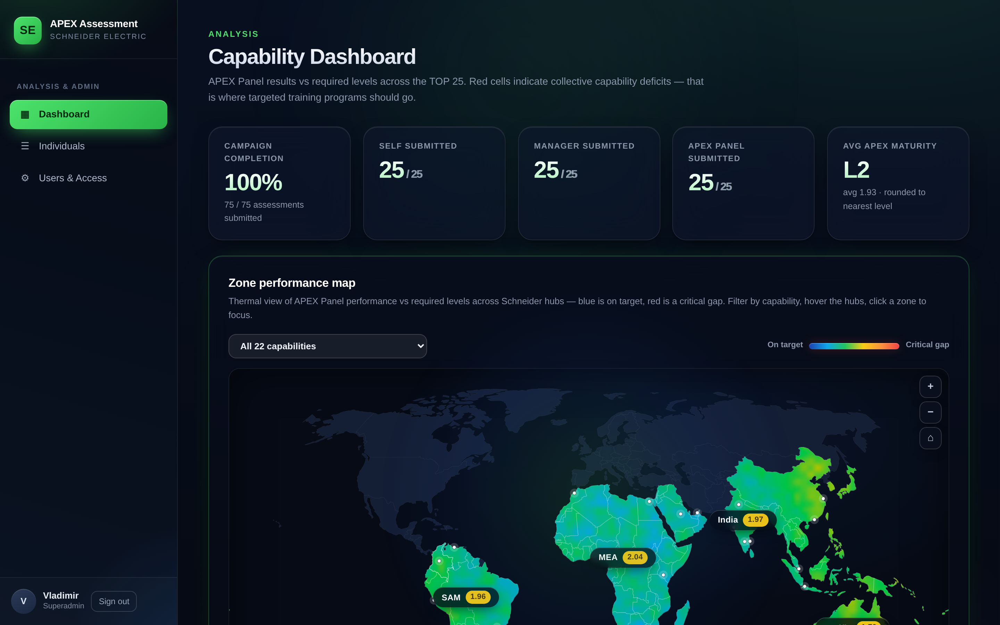
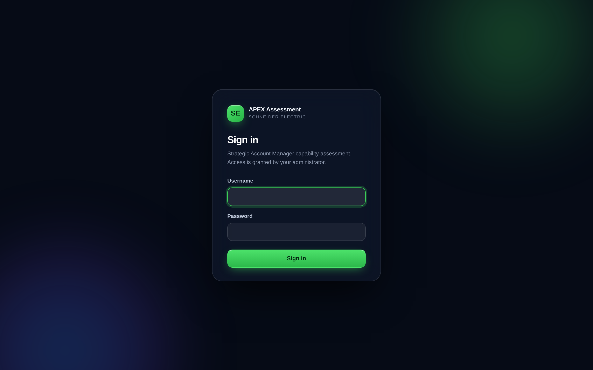

<div align="center">

# APEX Assessment

Capability assessment and analytics for the Schneider Electric APEX TOP 25 strategic account managers.

Next.js 15 · React 19 · TypeScript · SQLite · React PDF

</div>

<br>



<br>

## Overview

APEX Assessment replaces a spreadsheet workbook with a fast, confidential web application for evaluating the top 25 strategic and key account managers. Every manager is rated on 22 capabilities grouped into 6 themes, against three independent lenses: their own self assessment, their line manager, and the APEX Panel of global account leaders. The application turns those ratings into clear individual reports and zone level analytics that show exactly where to focus development and training.

The app is the system of record. The rubric and roster were seeded once from the original workbook, and every rating after that is created in the app.

## What it does

1. **Three assessment lenses.** Self, Manager, and APEX Panel each rate the same person independently. Evaluators never see one another's scores, so every assessment stays blind and unbiased.
2. **Guided rating wizard.** One capability per screen with the behavioural anchors inline, keyboard shortcuts, autosave, a progress view, and a final review before submitting. Required levels stay hidden while rating to avoid anchoring bias.
3. **Per theme notes.** Manager and Panel evaluators add one written note per theme. Self assessors add none.
4. **Individual PDF report.** A four page report per person: a cover, a scores overview, a written narrative organised by capability cluster, and the full capability detail with the theme notes.
5. **AI feedback, built in.** The narrative page is written by Kimi (Moonshot AI) from the person's own scores and comments, grouped by capability cluster. If the service is unreachable, the report falls back to a built in deterministic narrative, so exports never break.
5b. **APEX Assistant.** A floating chat bubble on every page answers quick questions over the live assessment data ("which skill gaps are most frequent in India", "does X have a perception gap on Pipeline Shaping"). Each account's assistant sees only the data that account can already access: superadmins get everything, assessors get only their own work.
6. **Zone level analytics.** A thermal world map, capability heat maps, perception gaps, and a recommended training focus across the four regions (MEA, SAM, India, Pacific).
7. **Confidential by design.** Individual results and analysis are restricted to superadmins. Role and lens checks run on every page and every server action, not only in the interface.
8. **Self assessors land on their own page.** A self assessor signs in and goes straight to their own assessment, with no ability to pick anyone else.

## Screens

<div align="center">



</div>

## Tech stack

Next.js 15 with the App Router and Server Actions, React 19, TypeScript, `better-sqlite3` for storage, and `@react-pdf/renderer` for the server rendered report. There are no external services to stand up. The SQLite database creates and seeds itself (rubric, 25 account managers, one superadmin) the first time the app runs.

## Quick start

```bash
cd apex-assessment
npm install
npm run dev
```

Open http://localhost:3010 and sign in as `vladimir` / `apex2026`.

To explore the analytics with data, open **Users and Access**, then **Load demo dataset**. To try the assessment flow from every lens, use **Create test sandbox**, which provisions three blank ready to use logins on one person.

## AI features (Kimi)

The Kimi (Moonshot AI) key is built into the code, so both AI features work with no setup: the PDF narrative page and the APEX Assistant chat bubble. To run without AI (for example while testing), start the server with `MOONSHOT_ENABLED=0`; the PDF then uses the built in deterministic narrative and the assistant says it is turned off.

## How it is built

The interface is a set of React Server Components. All writes go through Server Actions that re-check the caller's role and lens before touching the database, so the confidentiality rules hold even if the interface is bypassed. Passwords are hashed with scrypt and sessions are stored in the database behind an httpOnly cookie. Analytics read from submitted assessments only, so drafts stay private to their author. The individual PDF is rendered on the server on request, straight from live data.

## Testing

```bash
npm run build          # production build and full type check
```

An end to end suite drives the real interface with Playwright and covers login, confidentiality, the rating wizard, theme notes, the self assessor flow, the sandbox, PDF export, and account deletion.

```bash
# in a second shell, against a fresh production server on port 3111
node e2e/smoke.mjs
```

## Project layout

```
apex-assessment/
  src/app/            routes: login, rating wizard, analysis, admin
  src/lib/            data access, auth, PDF, narrative, seed data
  e2e/                Playwright smoke suite
  .env.example        environment template for the optional AI key
docs/
  source-materials/   the original brief and workbook
  screenshots/        images used in this readme
DEPLOY.md             hosting and deployment guide
NOTICE.md             dependency licenses
```

## Documentation

`docs/ACCOUNT-GUIDE.md` is a short, practical guide for administrators on creating logins and assigning them to people.

`DEPLOY.md` covers requirements, hosting options, environment variables and how to run the test suite.
